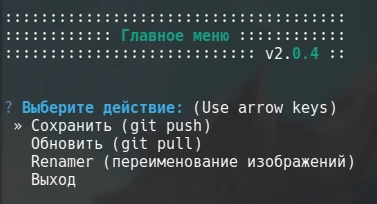

<h1 align="center">₍^. ̫ .^₎⟆</h1>

## 🐾 Что это такое?

Здесь находится моя личная коллекция обоев для рабочего стола и пространство экспериментов в автоматизации и программировании! Здесь вы сможете как насладиться красивыми изображениями, так и попробовать набор инструментов, написанных специально для удобного управления этим репозиторием.


### 🐾 А где?

А вот! Все картинки отсортированы по разрешению. Планируется улучшить логику хранения и распределения по директориям, ждите обновлений.

```shell
/cuberbug-walls/
└── wallpapers    # Обои в высоком разрешении (1440р и выше)
    ├── 1080p     # Обои в низком разрешении
    ├── bucket    # Корзина: файлы в ней будут удалены через некоторое время
    ├── contrib   # Для предложений ваших изображений в коллекцию
    ├── Grymzik   # Именная директория (beta)
    ├── mobile    # Вертикальные обои
    └── other     # Изображения без категории
```

---

# 🛠️ Инструменты

>Сразу после клонирования директория `./tools/` будет пуста: всё так и должно быть! Если вам не хочется устанавливать инструменты — просто не запускайте `manager.sh`.

Для того, чтобы воспользоваться инструментами, вам достаточно запустить скрипт `manager.sh`, который всё сделает автоматически. Есть 2 типичных сценария его использования:

1. Запуск из файлового менеджера двойным кликом по файлу _(**рекомендуется**)_: скрипт выполнится в тихом режиме.
2. Запуск из терминала, например командой `./manager.sh` из корня репозитория: во время выполнения скрипт будет выводить дополнительную информацию о своей работе.

В обоих случаях скрипт сделает следующие действия: _(примерно за 3-5 секунд)_

- Загрузит сабмодуль с инструментами в директорию `./tools/` либо обновит его до последней релизной версии;
- Попытается найти один из установленных в вашей системе эмуляторов терминала в своём списке;
- Если эмулятор терминала найден, то откроет в нём новое окно и запустит там скрипт `./tools/start.sh`.

Всё готово к использованию! А если хочется деталей, то они ждут вас ниже.



## 🐾 Зависимости

-  [Git](https://git-scm.com)
-  [Python](https://www.python.org) ≥ 3.10

### 🐾 Поддерживаемые терминалы

-  Konsole
-  GNOME Terminal
-  Console
-  xfce4-terminal
-  kitty
-  Alacritty
-  XTerm

Наличие эмулятора терминала проверяется в указаной выше последовательности. Скрипт `./tools/start.sh` будет выполняться в первом найденном терминале. Для расширения поддерживаемого списка терминалов можно обраиться ко мне в [issues](https://github.com/cuberbug/cuberbug-walls/issues).

## ⚙️ **Repo-Tools**

[**Repo-Tools**](https://github.com/cuberbug/repo-tools) — это отдельный репозиторий с набором инструментов, подключающихся сюда посредством установки сабмодуля. Для его установки достаточно запустить `./manager.sh` — он всё сделает сам, а содержимое репозитория **Repo-Tools** окажется в директории `./tools/`, после чего в новом окне терминала будет запущен скрипт `./tools/start.sh`, который предложет автоматически установить виртуальное окружение Python в `./tools/.venv`, установит все необходимые зависимости и предложит запустить интерактивное TUI-меню, в котором доступен запуск любого из инструментов.

### 🐾 Menu

Интерактивное меню — это первое, что встретит вас после запуска инструментов. Вот что оно умеет:
- выполнять Git-операции (`push` / `pull`) через модуль **GitOps**;
- запускать [**Renamer**](https://github.com/cuberbug/repo-tools/blob/main/apps/renamer/README.md) для автоматического переименования изображений;
- быстро переключаться между режимами работы и завершать программу.

#### 🐾 А ещё?

Можно и ещё! Подробнее об инструментах вы можете почитать в [README.md](https://github.com/cuberbug/repo-tools/blob/main/README.md) репозитория [**Repo-Tools**](https://github.com/cuberbug/repo-tools).

---
<h1 align="center">🌾🌾🌾₍^. ̫ .^₎⟆🌾🌾🌾</h1>


## 🐾 Именные директории _(beta)_

В моей коллекции со временем будут появляться директории, связанные с конкретными людьми, будь то источники или художники и их работы. В таком случае к каждой именной директории будет добавлен свой `README.md` с описанием и ссылками, если это возможно. Если вам захочется связаться с автором, выразить ему благодарность или что-то предложить — не стесняйтесь воспользоваться такой возможностью!

## 🐾 Спасибо? Спасибо!

Выражаю благодарность [Жоре](https://github.com/Katze-942) за помощь с идеями! ❤️
